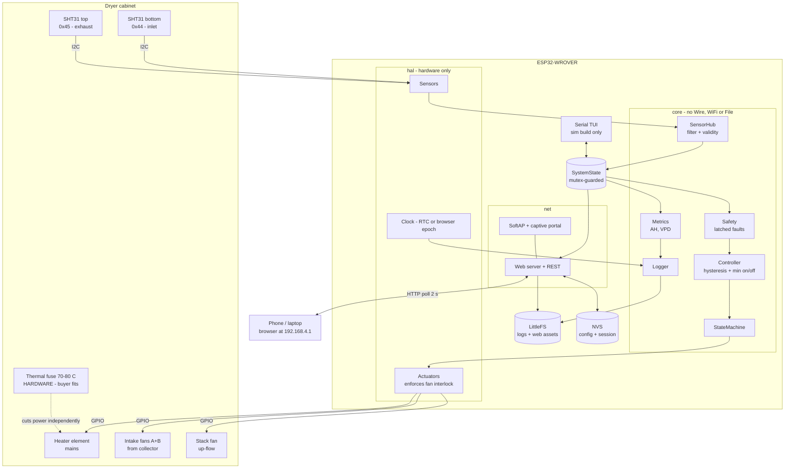
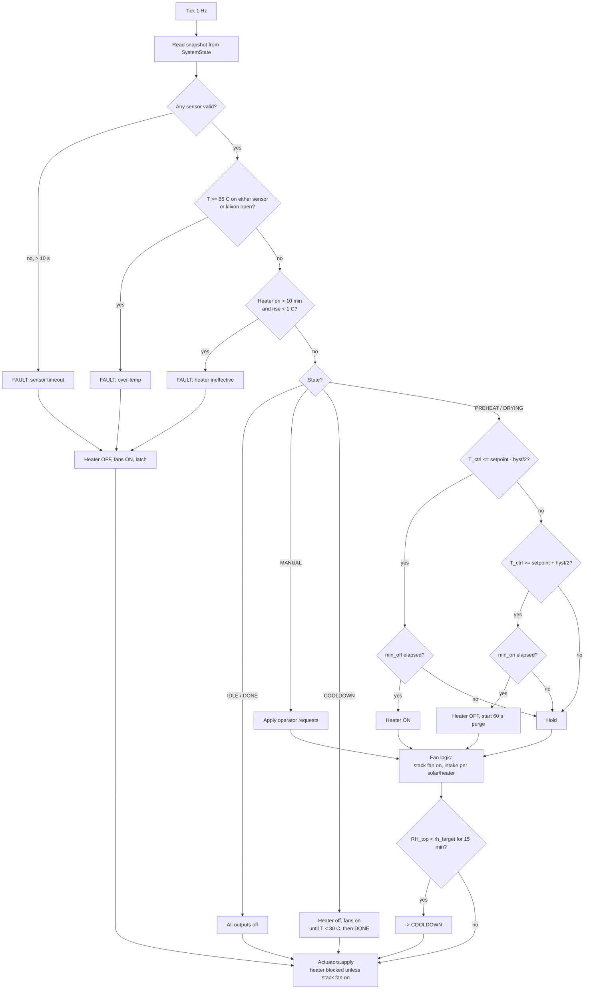
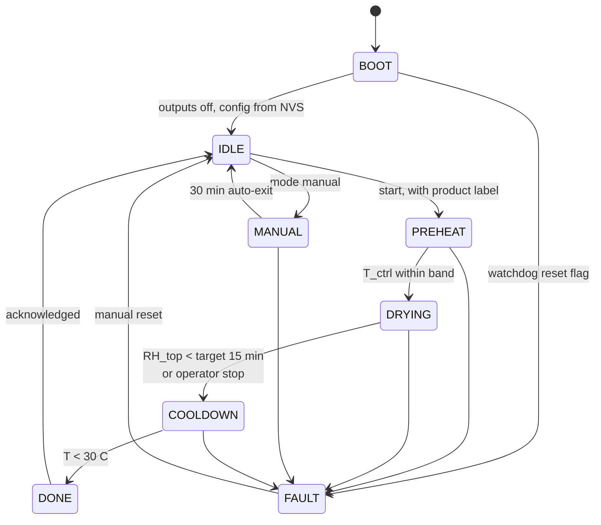

# Hybrid Solar / Electric Food Dehydrator — ESP32 Firmware Architecture

Target hardware: the hybrid (solar collector + electric backup) dryer from
`хатаах-төхөөрөмж-2025`. Solar collector preheats intake air, an electric heater covers the
shortfall, fans force circulation through the drying cabinet, sensors at cabinet bottom and
top measure T/RH, the ESP32 hosts its own Wi-Fi AP with a live-numbers control page, and all
samples are logged to flash and downloadable as CSV.

Board: **ESP32-WROVER** (4 MB flash, PSRAM).

---

## 0. Scope and handover terms

**v1 deliverable**

- Firmware source (PlatformIO project), both a `sim` build and a `hw` build.
- Flashing + filesystem-upload instructions.
- One wiring diagram showing every connection.

**Explicitly not in v1**

- In-browser charts. The thesis graphs are plotted in Excel/Origin from the CSV export, so
  the web page shows live numbers, start/stop, and a setpoint field — nothing more.
- WebSocket push (v1 polls `/api/status`), merged multi-day export, OTA, cloud/remote access.
- Parts procurement, cabinet assembly, and **all mains wiring** — the buyer does these.

**Safety responsibility**

A mechanical thermal fuse or thermostat (~70–80 °C) in series with the heater element is
**mandatory and fitted by the buyer**. This is a mains-powered heater drying wet food on
unattended overnight runs. The firmware's over-temp trip at 65 °C, the fan interlock, and
the sensor-timeout cutout are all *software* protection — software is not the last line of
defence and must not be treated as one. Firmware is supplied for a device the buyer wires,
assembles, and operates.

**Support window**

Two weeks of bug fixes after handover. After that it is a new conversation. Debugging
faults in the buyer's wiring, sensors, or cabinet is not covered — a single flaky sensor
cable can consume more hours than the whole firmware.

**Rights**

The author retains ownership of the source and the right to reuse it. The buyer gets
unlimited use on this unit.

---

## 1. Assumptions (change these if wrong)

- **3 fan channels**: 2 intake fans (pull warm air from the collector into the cabinet
  bottom, driven as one logical group) + 1 stack fan (pushes air up through the trays and
  out the chimney, controlled independently). With only 2 fans total, drop `FAN_INTAKE_B` —
  nothing else changes.
- **Sensors**: 2 × SHT31 (I²C, ±0.3 °C / ±2 %RH, rated to 125 °C). Not DHT22: its RH
  accuracy degrades badly above 80 %RH, which is exactly where the first hours of drying sit
  and RH is the headline measurement.
- **Heater** switched by an SSR or opto-isolated relay. Fans on relay if AC, on MOSFET /
  LEDC PWM if 12–24 V DC.
- **Setpoint 44 °C with a hysteresis band**, not a bare threshold — see §6.

---

## 2. Hardware / pin map (ESP32-WROVER)

| Function | GPIO | Notes |
|---|---|---|
| I²C SDA / SCL | 21 / 22 | 100 kHz, 4.7 kΩ pull-ups |
| SHT31 bottom | addr 0x44 | ADDR pin low |
| SHT31 top | addr 0x45 | ADDR pin high; shielded/twisted cable up the cabinet |
| Heater SSR | 27 | most relay boards are **active-LOW** — idle level set in `hal` |
| Fan intake A | 32 | relay, or LEDC ch0 if DC |
| Fan intake B | 33 | relay, or LEDC ch1 |
| Fan stack (up-flow) | 25 | relay, or LEDC ch2 |
| Over-temp klixon echo | 34 | input-only pin, reads the hardware interlock state |
| Status LED | 2 | onboard |
| Buzzer (optional) | 4 | fault + drying-finished |
| DS3231 RTC (optional) | I²C 0x68 | see §8 on timekeeping |

**WROVER-specific**: GPIO **16 and 17 are wired to the PSRAM** and must not be used for
anything else. Also avoid GPIO 6–11 (SPI flash) and 12/15 (strapping); 34–39 are
input-only. Build with `-DBOARD_HAS_PSRAM`; the extra RAM is headroom for the web server,
not required by the control loop.

If the ~1.5 m run to the top sensor proves flaky, drop the bus to 50 kHz or move that
sensor to `Wire1` — don't add a repeater.

---

## 3. Block diagram



Rule that makes this testable: `core` never touches `Wire`, `WiFi`, or `File`, and `net`
never touches GPIO. Swapping the two `hal` implementations is the whole trick behind the
sim build (§4).

---

## 4. Two builds: `hw` and `sim`

The electronics don't exist yet, so `hal` ships in two interchangeable implementations
behind the same interfaces:

| | `env:hw` | `env:sim` |
|---|---|---|
| `Sensors` | real SHT31 over I²C | `SimSensors` — reads a thermal plant model |
| `Actuators` | real GPIO / LEDC | `SimActuators` — feeds the plant model, logs changes |
| Serial TUI | off | **on** — inject values, force faults, accelerate time |
| Everything else | identical | identical |

`core`, `net`, storage, the web page, and the CSV format are byte-identical between builds.
The `sim` build runs on a bare ESP32-WROVER dev board with nothing attached, which means
the control logic, the safety trips, the logging, and the whole web UI can be finished and
validated before a single wire is crimped.

**Plant model** (1 Hz step, `dt` scaled by the TUI time factor):

```
Psat(T)   = 0.61078 * exp(17.27*T / (T + 237.3))          # kPa, Magnus
AH(T,RH)  = 216.7 * (RH/100 * Psat(T)*10) / (273.15 + T)   # g/m3

dT_cab/dt = K_h*heater + K_sol*solar*fan_in
            - (k_loss + k_fan*fan_up) * (T_cab - T_amb)

dM/dt     = -c_dry * M * max(0, T_cab - T_amb) * (0.5 + 0.5*fan_up)

T_top     = T_cab - (2 + 2*(1 - fan_up)) - 3*M            # evaporative cooling
RH_bot    = RH_amb * Psat(T_amb) / Psat(T_cab)            # heating dries the air
RH_top    = clamp(RH_bot + 70*M, 0, 99)                   # moisture picked up in cabinet
```

Defaults `K_h = 0.12`, `K_sol = 0.03`, `k_loss = 0.0035`, `k_fan = 0.0015`,
`c_dry = 3e-6`, `T_amb = 22`, `RH_amb = 40`, `M = 1.0`. These put heater-on steady state at
~46 °C — just above the setpoint, so the hysteresis genuinely cycles — with a ~3 min thermal
time constant and a ~4 h drying curve. Fresh product reads ~80 %RH at the top sensor,
matching the field data on slides 10–16.

---

## 5. Concurrency model (FreeRTOS)

| Task | Period | Core | Prio | Job |
|---|---|---|---|---|
| `sensorTask` | 1 s | 1 | 3 | read both sensors, filter, publish snapshot |
| `controlTask` | 1 s | 1 | 4 | safety → state machine → actuators |
| `loggerTask` | 10 s (configurable) | 0 | 2 | append one CSV row, flush, rotate |
| `netTask` | event-driven | 0 | 1 | async web server, own task |
| `tuiTask` | 50 ms | 0 | 1 | serial line reader, `sim` build only |
| Task watchdog | — | — | — | control task subscribes; after a reset the heater boots off |

Shared state is **one** `SystemState` struct behind a mutex. Sensor and control tasks write
it; web handlers and the TUI take a *copy* under the mutex and release immediately. No
blocking flash or I²C work inside an async HTTP handler — that is the standard way to crash
ESPAsyncWebServer. CSV downloads stream from a chunked response callback.

One safety invariant, enforced in exactly one place (`Actuators::apply`): the heater cannot
be energised unless the stack-fan output is on.

---

## 6. Control law

```
setpoint       = 44.0 C   (configurable)
hysteresis     =  1.0 C   -> heater ON at <= 43.5, OFF at >= 44.5
min_on_time    = 30 s     -> relay/SSR and element life
min_off_time   = 30 s
control_sensor = bottom (inlet); falls back to top if bottom is invalid
```

Inlet air is what the heater actually controls, so the bottom sensor is the control input
and the top sensor is the process/quality measurement.

- **Fans**: the stack fan runs throughout PREHEAT/DRYING plus a 60 s post-purge after the
  heater turns off — that purge is what stops residual element heat from scorching the
  bottom tray. Intake fans run when `T_collector_out > T_cabinet + 2 C` (free solar heat)
  or whenever the heater is on.
- **Finish detection**: top-sensor RH below `rh_target` (default 25 %) held for 15 min, or
  moisture-removal rate below a floor → COOLDOWN → DONE. More defensible than a fixed
  timer, and it produces a measured end-point for the thesis.
- **Latched faults** (explicit reset required from the UI or TUI):
  over-temp ≥ 65 °C on either sensor · both sensors invalid > 10 s · heater commanded on
  for 10 min with < 1 °C rise (dead element or failed SSR) · klixon input open.
  Every fault path drives heater OFF, fans ON, then latches.

---

## 7. Flow diagrams

**Control loop, one 1 Hz tick**



**Session lifecycle**



`session_id` and `started_at` are written to NVS on PREHEAT entry, so a brownout mid-run
does not orphan the log file.

---

## 8. Storage

- **NVS** — config and session metadata. Small, wear-levelled, survives OTA.
- **LittleFS** (~1.5 MB partition on 4 MB flash) — web assets + logs.
- One CSV per day, `/logs/20260820.csv`:

```csv
ts,t_bot,rh_bot,t_top,rh_top,ah_bot,ah_top,heater,fan_in,fan_up,state,session
1787196000,43.8,61.2,41.1,74.5,26.90,34.20,1,1,1,DRYING,7
```

An invalid sensor writes empty cells rather than zeros — a blank in Excel is honest, a
zero is a lie the chart will happily plot.

At 10 s intervals a row is ~65 B → ~560 kB/day. Rotation: when free space drops below 15 %,
delete the oldest file. Flush every row, close the file every N rows, and never hold a
`File` handle open across an operation that might reboot.

**Export**: `GET /logs/20260820.csv` streams the raw file straight off LittleFS — opens
directly in Excel. (Implementation note: the download path is `/logs/…`, not `/api/logs/…`,
so the build does not need the async server's regex-routing option; the listing endpoint is
still `/api/logs`.)

**Timekeeping**: in AP mode there is no NTP. Either fit a DS3231 (recommended — timestamps
survive power cuts), or have the page `POST /api/time` with the browser's epoch on connect.
Rows logged before time is known get `ts = -uptime_s` and are re-stamped once real time
arrives.

---

## 9. Derived metrics

From T and RH compute absolute humidity `AH` (g/m³) at both sensors, then

```
moisture removal rate  ∝  (AH_top − AH_bottom) × volumetric air flow
```

That difference is the physically meaningful drying signal — far better than plotting RH
alone, and it puts solar-only, hybrid, and open-sun runs on one comparable axis, which is
exactly the comparison slides 10–16 are making. Log VPD too as a proxy for vitamin-C
retention.

---

## 10. Web interface (v1)

SoftAP `DEHYDRATOR-XXXX`, WPA2, captive portal → `192.168.4.1`. One page, served gzipped
from LittleFS, polling `/api/status` every 2 s. No CDN links — there is no internet on this
AP. Live numbers, start/stop, setpoint field, fault banner, and a list of downloadable CSV
files. That is the whole UI.

| Method | Route | Purpose |
|---|---|---|
| GET | `/api/status` | temps, RH, AH, outputs, state, fault, session, uptime |
| GET/POST | `/api/config` | setpoint, hysteresis, rh_target, log interval, sensor offsets |
| POST | `/api/mode` | `off` \| `auto` \| `manual` |
| POST | `/api/manual` | `{heater, fan_in, fan_up}` — still safety-gated |
| POST | `/api/session` | start / stop, with a product label ("лууван", "ааруул") |
| POST | `/api/fault/reset` | clear a latched fault |
| GET | `/api/logs` | list files + sizes |
| GET | `/logs/{file}` | download one CSV (chunked, straight off LittleFS) |
| POST | `/api/logs/delete` | delete one file, `file=<name>` |
| POST | `/api/time` | set clock from browser |

Tag every session with the product name and initial moisture — then the export *is* the
table on slide 13 instead of something retyped by hand.

---

## 11. Serial TUI (`sim` build)

Line-based commands over USB serial at 115200, `\n`-terminated. This is the operator
console for the emulator: set the setpoint, inject sensor values, force faults, accelerate
time, and manage log data without any hardware attached.

```
help                       list commands
show                       one-shot state dump
mon on|off                 stream one status line per second

set setpoint 44.0          live config, same fields as /api/config
set hyst 1.0
set rh_target 25
set loginterval 10
save                       persist config to NVS

mode off|auto|manual
start [label]              begin a session
stop
reset                      clear latched fault
manual heater|fan_in|fan_up on|off

sim amb 22                 ambient temperature
sim solar 0.0..1.0         collector irradiance
sim moisture 1.0           reset product moisture
sim speed 1..500           time acceleration for the plant model
sim t_bot 55               override a sensor reading, plant model keeps running underneath
sim rh_top 80
sim clear                  drop all overrides
fault sensor bot|top|both|none
fault klixon on|off

log now                    force one row immediately
log list
log dump <file> [n]        print last n lines
log seed <hours>           fabricate synthetic history, for testing CSV export
log rm <file>
wifi                       AP ssid, ip, connected clients
```

`sim speed 120` is the important one: a 6-hour drying run and its finish detection can be
verified in three minutes.

---

## 12. Suggested stack

PlatformIO + `arduino-esp32`, `ESPAsyncWebServer` + `AsyncTCP`, `Adafruit_SHT31` (or
Sensirion's driver, `hw` build only), `ArduinoJson`, `LittleFS`, `Preferences`, optionally
`RTClib`. No WebSocket library in v1.

---

## 13. Build order

1. `env:sim` skeleton: plant model + TUI + `show`. No web, no flash writes.
2. `core`: Controller, Safety, StateMachine. Verify hysteresis and every fault trip from the
   TUI, with `sim speed` for the slow ones.
3. `Logger` + LittleFS + rotation. Validate a seeded day of data.
4. AP + `/api/status` + the live-numbers page + CSV download.
5. `env:hw`: swap in real `Sensors`/`Actuators`. Confirm relay idle polarity **before**
   wiring mains.
6. Field runs mirroring slides 10–16: solar-only, hybrid, and open-sun control.
